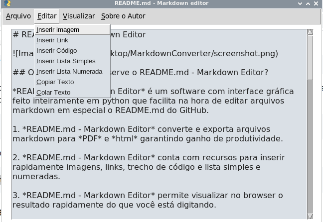

# README.md - Markdown Editor

 

## O que é e para que serve o README.md - Markdown Editor?

*README.md - Markdown Editor* é um software com interface gráfica feito inteiramente em python e [PySimpleGui](https://github.com/PySimpleGUI/PySimpleGUI) que tem por finalidade facilitar na hora de editar arquivos markdown em especial o README.md do GitHub.

1. *README.md - Markdown Editor* converte e exporta arquivos markdown para *PDF* e *html* garantindo ganho de produtividade.

2. *README.md - Markdown Editor* conta com recursos para inserir rapidamente imagens, links, trecho de código e lista simples e numeradas.

3. *README.md - Markdown Editor* permite visualizar no browser o resultado rapidamente do que você está digitando.  

## Como instalar o *README.md - Markdown Editor*?

Utilize o comando abaixo para clonar o repositório:
 
~~~python

git clone https://github.com/elizeubarbosaabreu/README-md-Markdown-Editor.git

~~~
 
Em seguida navegue até dentro da pasta e crie um ambiente de desenvolvimento virtual para instalar os requerimentos:
 
~~~python

cd README-md-Markdown-Editor
python3 -m venv .venv
source ./.venv/bin/activate

~~~

Se estiver usando o Windows o comando é um pouco diferente:

~~~python

cd README-md-Markdown-Editor
python -m venv .venv
source ./.venv\bin\activate.bat

~~~

Instale os requerimentos e bibliotecas:
 
~~~python

pip install -r requirements.txt

~~~
 
Pronto agora só usar o *README.md - Markdown Editor*:
 
~~~python

python app.py

~~~
 

## Dicas:
* Ainda dentro da **env** instale o *pyinstaller* para transformar o app.py em executável. [Clique aqui](http://www.pyinstaller.org/) para saber mais
* Compartilhe o conhecimento!!!!
